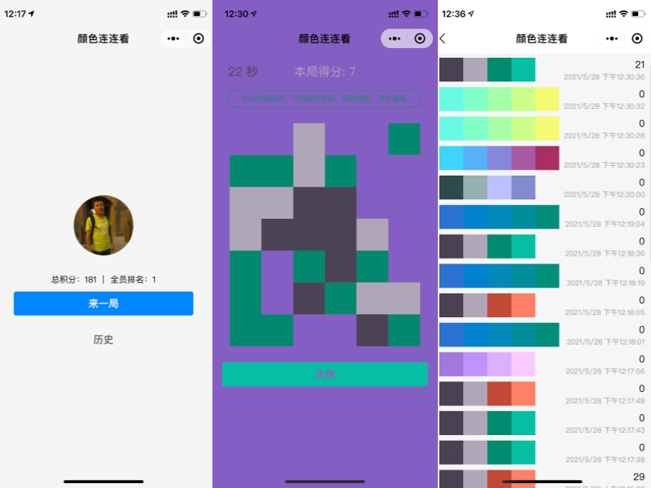
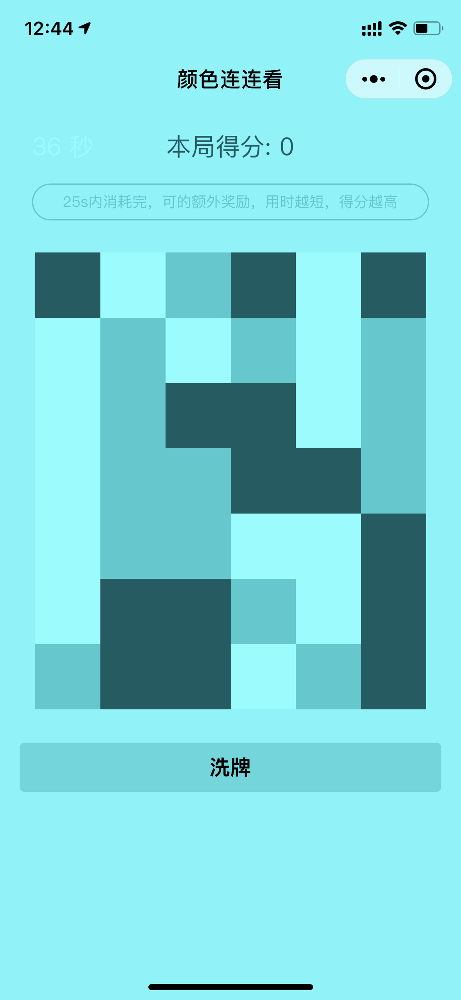

 # 2021 TCBC 云开发技术竞赛#-颜色连连看-个人参赛

队伍名称：个人参赛
队伍成员：tylerccwang

作品简介：

颜色连连看，通过连连看的方式来感知颜色的魅力。

**后台精心选好搭配颜色，每次开局都是不一样的颜色。**

作品类型：
小程序

云开发能力应用情况：
云函数、云数据库...

功能模块介绍

模块一：个人信息，全局排名，游戏历史。

云数据存储用户信息，每局的游戏信息。

模块二： 颜色连连看

连连看开局，随机从后端获取颜色方案，通过连连看的方式来感知颜色的魅力。

模块三： 【TODO】连连看对局

时间来不及了，做不了对战了～～～

体验二维码/网址：

源码链接

https://github.com/yijian166/color-linklink

[演示视频](./images/demo.MP4)
